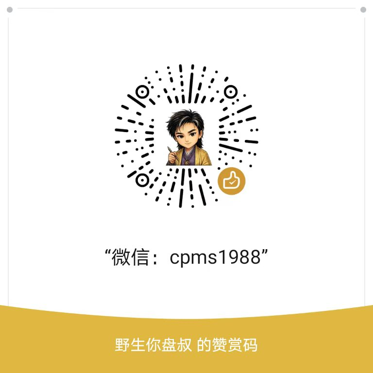

# 渊海子平 · 八字断法技能包（yaunhai-shiping）

《渊海子平评注》蒸馏产出的八字分析技能包，共 **12 个子技能**，覆盖正格、外格、女命神煞、建禄月刃、性情、疾病、大运、纳音等断法维度。

> 本技能包由 [命学真典（mingxue-zhendian）](https://github.com/x3747991-ship-it/mingxue-zhendian) SKILL 蒸馏产出。

## 技能清单

| 技能 name | 一句话用途 |
| --- | --- |
| `yaunhai-zhengguan-ge` | 正官格判断、官运仕途、女命婚姻夫运 |
| `yaunhai-qisha-ge` | 七杀格判断、武贵权力、压力灾祸、女命偏夫 |
| `yaunhai-cai-ge` | 财格判断、财运、求财方式、男命婚姻 |
| `yaunhai-yin-ge` | 印格判断、学业学历、母亲、贵人庇护、子息 |
| `yaunhai-shishang-ge` | 食神格+伤官格判断、才华技艺、子女运、伤官克夫 |
| `yaunhai-waige` | 外格+从格+化格判断、特殊格局配置 |
| `yaunhai-nvming-shensha` | 女命婚姻夫运子息、神煞吉凶判断 |
| `yaunhai-jianlu-yueren-ge` | 建禄格+月刃格+日刃格判断、禄刃身旺取用 |
| `yaunhai-xingqing` | 八字性情、性格五行判断 |
| `yaunhai-jibing` | 八字健康疾病、脏腑对应、五行致病 |
| `yaunhai-dayun` | 大运排法交运、太岁吉凶、日犯岁君 |
| `yaunhai-nayin` | 六十甲子纳音体系、先天气质 |

## 使用方法

### 1. 导入技能

每个子技能是一个独立的文件夹，文件夹内只有一个 `SKILL.md`：

- 打开 AI 助手（如 TRAE），找到「技能」或「插件」入口
- 点「导入」，选中本仓库下任意一个子技能文件夹（如 `yaunhai-zhengguan-ge/`）
- 一次建议只开启当前用得上的几个

### 2. 使用方式

给助手一个八字排盘（四柱天干地支），然后问对应领域的问题，例如：

- 「帮我看下这个八字婚姻怎么样」（触发 `yaunhai-zhengguan-ge` / `yaunhai-nvming-shensha` 等）
- 「我这个八字什么时候能发财」（触发 `yaunhai-cai-ge`）
- 「我八字伤官旺，是不是不适合做管理」（触发 `yaunhai-shishang-ge`）
- 「我明年交运换甲，要注意什么」（触发 `yaunhai-dayun`）

### 3. 技能间关系

- 格局类技能（正官/七杀/财/印/食伤/外格/建禄月刃）需先判断格局再断事
- 断事类技能（性情/疾病/大运/纳音/女命神煞）可按需独立调用
- 详见 [测试题.md](./测试题.md) 的触发用例

## 目录结构

```
yaunhai-shiping/
├── yaunhai-zhengguan-ge/        # 正官格
│   └── SKILL.md
├── yaunhai-qisha-ge/            # 七杀格
│   └── SKILL.md
├── yaunhai-cai-ge/              # 财格
│   └── SKILL.md
├── yaunhai-yin-ge/              # 印格
│   └── SKILL.md
├── yaunhai-shishang-ge/         # 食神伤官格
│   └── SKILL.md
├── yaunhai-waige/               # 外格
│   └── SKILL.md
├── yaunhai-nvming-shensha/      # 女命神煞
│   └── SKILL.md
├── yaunhai-jianlu-yueren-ge/    # 建禄月刃格
│   └── SKILL.md
├── yaunhai-xingqing/            # 性情
│   └── SKILL.md
├── yaunhai-jibing/              # 疾病
│   └── SKILL.md
├── yaunhai-dayun/               # 大运
│   └── SKILL.md
├── yaunhai-nayin/               # 纳音
│   └── SKILL.md
├── 测试题.md                     # 双层诱饵测试题（含触发用例）
├── LICENSE                      # MIT 许可证
├── README.md                    # 本文件
└── appreciation.jpg             # 赞赏二维码
```

## 蒸馏来源

- **原书**：《渊海子平评注》
- **蒸馏工具**：[命学真典 SKILL V0.3](https://github.com/x3747991-ship-it/mingxue-zhendian)
- **结构主干**：格局型
- **归并策略**：按格局分组，每个格局一个技能；通用断法章（性情/疾病/大运/纳音）独立成包

## 苍盘命书 · 体验官招募

如果你对八字命理感兴趣，想深度体验「苍盘十卷定命书」的实战推演，欢迎参加盘叔的公众号活动——**招募 100 名苍盘命书体验官**。

👉 点击了解并报名：[苍盘命书招募 100 名体验官](https://mp.weixin.qq.com/s/rLHeB6iBJYMZy78PkxHpnQ)

## 许可证

[MIT](./LICENSE) © 野生你盘叔

## 赞赏

如果这个技能包对你有帮助，欢迎请盘叔喝杯茶。

<p align="center">
  
</p>

---

> 公众号：【野生你盘叔】 出品 · 由命学真典 SKILL 蒸馏
